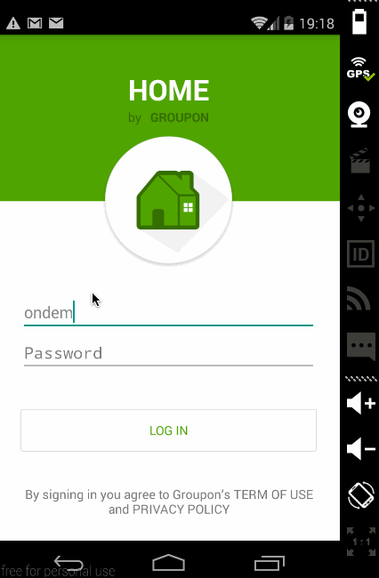

# Group Project - *GWorker*

Groupon Home & Auto is currently building a new platform for consumers to directly book house cleaning appointments with Groupon.
**GWorker** is the Android app that allows fieldworkers to view their daily schedule and update price onsite.

Time spent: **45** hours spent in total

## User Stories

The following functionality will be completed:

* [X] Fieldworker can **sign in to GWorker** using OAuth login
* [X] Fieldworker can **view today's scheduled jobs**
  * [X] Each job is displayed arrival time, current status, price
  * [X] Job location is displayed in a map
  * [X] Fieldwoker can tab to call or message customer
* [X] Fieldworker can **view and update their profile**
  * [X] Fieldworker can view their star ratings
  * [X] Fieldworker can view and edit name, phone number, email
  * [X] Fieldworker can use the camera to take a profile picture
* [X] Fieldworker can navigate among jobs, account, and notifications using sliding tabs

The following **additional** features might be implemented if time allows:
* [X] Fieldworker location is displayed in the map
* [ ] Driving time is calculated and displayed next to job location
* [X] Fieldworker can update job price after checking details onsite
* [ ] Fieldworker receives notifications if a new job is assigned to him/her
* [ ] Fieldworker can view all appointments (Historial, Upcoming, and Todays) in a nice calendar view

## Video Walkthrough

Here's a walkthrough of implemented user stories:

GIF created with [LiceCap](http://www.cockos.com/licecap/).

## Open-source libraries used

- [Retrofit](http://square.github.io/retrofit/) - A type-safe HTTP client for Android and Java
- [Picasso](http://square.github.io/picasso/) - Image loading and caching library for Android
- [Butter Knife](http://jakewharton.github.io/butterknife/) - Field and method binding for Android views

## License

    Copyright [2015] [Groupon]

## Acknowledgement
    Special thanks to our team's designer Natalia Mozol to help out designing mockups.
